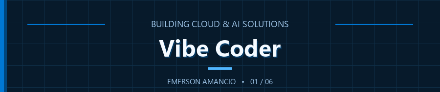
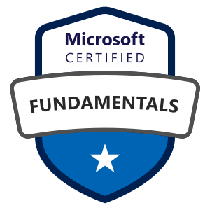

<h1>Emerson Amancio</h1>

<strong>Microsoft Solutions Architect</strong>

  Cloud Architecture &nbsp;•&nbsp; Prompt Engineering &nbsp;•&nbsp; Agentic Systems &nbsp;•&nbsp; Data Protection

  
  

## Professional Profile

Projeto soluções seguras, escaláveis e com governança em todo o ecossistema de nuvem Microsoft, transformando requisitos complexos em arquiteturas claras, resilientes e desenvolvidas para gerar valor no longo prazo.

Minha atuação está na interseção entre arquitetura de nuvem e inteligência artificial aplicada. Utilizo engenharia de prompts e padrões agênticos para simplificar fluxos de trabalho complexos, mantendo a proteção de dados e o tratamento responsável das informações no centro de cada solução.

## Areas of Focus

<table>
  <tr>
    <td width="50%" valign="top">
      <strong>Solution Architecture</strong> 
      Desenvolvimento de arquiteturas sustentáveis e de fácil manutenção, alinhando as decisões tecnológicas aos resultados de negócio.
    </td>
    <td width="50%" valign="top">
      <strong>Microsoft Cloud</strong> 
      Construção de soluções com Azure e Microsoft 365, priorizando segurança, governança e clareza operacional.
    </td>
  </tr>
  <tr>
    <td width="50%" valign="top">
      <strong>Applied AI & Agentic Systems</strong> 
      Engenharia de prompts e fluxos de trabalho orientados por agentes para criar automações práticas e confiáveis.
    </td>
    <td width="50%" valign="top">
      <strong>Data Protection</strong> 
      Incorporação de princípios de privacidade e tratamento responsável de dados desde a concepção das soluções.
    </td>
  </tr>
</table>

## Microsoft Credentials

Certificações que demonstram uma trajetória desde os fundamentos do ecossistema Microsoft até a administração e a arquitetura avançada de soluções Azure.

<table>
  <tr>
    <td align="center" width="25%">
       
      <strong>MS-900</strong> 
      Microsoft 365 Certified: Fundamentals
    </td>
    <td align="center" width="25%">
       
      <strong>AZ-900</strong> 
      Microsoft Certified: Azure Fundamentals
    </td>
    <td align="center" width="25%">
       
      <strong>AZ-104</strong> 
      Microsoft Certified: Azure Administrator Associate
    </td>
    <td align="center" width="25%">
       
      <strong>AZ-305</strong> 
      Microsoft Certified: Azure Solutions Architect Expert
    </td>
  </tr>
</table>

## Platforms & Tools

  
  &nbsp;
  
  &nbsp;
  
  &nbsp;
  
  &nbsp;
  
  &nbsp;
  
  &nbsp;
  

  Azure · Microsoft 365 · Claude Code · Cursor · GitHub · Microsoft Fabric · Microsoft Foundry

  

  Docker · Cloudflare · Git · Terraform · Ubuntu · Visual Studio Code · Windows

## Let's Connect

Tenho interesse em trocar experiências sobre arquitetura Microsoft Cloud, adoção prática de inteligência artificial, sistemas agênticos e proteção de dados.

- [Conecte-se comigo no LinkedIn](https://www.linkedin.com/in/emerson-amancio-383866162/)
- [Conheça meu trabalho no GitHub](https://github.com/emerson-amancio)

Projetando com clareza. Automatizando com propósito. Protegendo dados desde a concepção.

